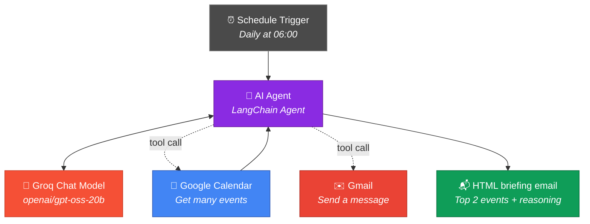

<div align="center">

# 📅 NextLeap — Google Calendar AI Assistant

**An autonomous n8n AI Agent that reads your Google Calendar, decides which two meetings actually matter, and emails you a beautifully formatted HTML briefing — every single morning.**

[](https://n8n.io)
[](https://js.langchain.com/)
[](https://console.groq.com)
[](https://developers.google.com/calendar)
[](https://developers.google.com/gmail)
[](LICENSE)

</div>

---

## 📖 Overview

This repository contains **[`Calendar Assistant.json`](Calendar%20Assistant.json)** — a complete, import-ready **n8n** workflow built during a NextLeap AI workshop (*15 min n8n setup & walkthrough + 45 min build-your-first-AI-agent*).

Every day at **6:00 AM**, an AI Agent:

1. Fetches **all events for the day** from Google Calendar.
2. **Reasons** over each event's *title*, *description* and *attendee list* to work out which two matter most.
3. Explains **why** it picked them.
4. Sends a **nicely formatted HTML email** to your inbox with the verdict.

No manual triage. No scrolling through 14 meetings. Just a two-minute briefing in your inbox before your day starts.

---

## ✨ What Makes It "Smart"

A naive automation would just list your events. This agent **ranks** them. It infers importance from signals such as:

| Signal | Example |
| --- | --- |
| **Title keywords** | `Board Review`, `Client Kickoff`, `Deadline`, `Demo`, `1:1` |
| **Description context** | `Final approval required`, `contract signing`, `Q4 targets` |
| **Attendee seniority** | A CEO / VP / external client on the invite raises the stakes |
| **Attendee count** | A 12-person all-hands outranks a solo focus block |
| **Meeting type** | Recurring internal syncs rank below one-off, high-stakes meetings |

> The agent decides the ranking at runtime — no hard-coded rules, no keyword lists to maintain.

---

## 🏗️ Architecture



### Node breakdown

| # | Node | Type | Role |
| --- | --- | --- | --- |
| 1 | **Schedule Trigger** | `n8n-nodes-base.scheduleTrigger` | Fires every day at **6:00 AM** |
| 2 | **AI Agent** | `@n8n/n8n-nodes-langchain.agent` | Orchestrates the reasoning + tool calls |
| 3 | **Groq Chat Model** | `@n8n/n8n-nodes-langchain.lmChatGroq` | Supplies the LLM brain |
| 4 | **Get many events in Google Calendar** | `n8n-nodes-base.googleCalendarTool` | **Tool** — reads the day's calendar |
| 5 | **Send a message in Gmail** | `n8n-nodes-base.gmailTool` | **Tool** — delivers the HTML briefing |

Nodes 4 and 5 are attached to the agent via the `ai_tool` connection type — the agent decides *on its own* when to call them.

---

## 🧠 The Agent Instruction

**Variant A — Plain text version**

> Look at my events/meetings for the day and send me an email on the top two most important events of the day and tell me why. Look at the event title, description, attendees to find this out.

**Variant B — Formatted HTML version** *(recommended)*

> Look at my events/meetings for the day and send me a nicely formatted HTML email on the top two most important events of the day and tell me why. Look at the event title, description, attendees to find this out.

**Variant C — Production-hardened version** *(try it once you've got the basics working)*

> You are my executive productivity assistant. Review every event scheduled for today and identify the **two most important** ones.
>
> Rank events using: the event title, the event description, and the list of attendees (prioritise meetings involving executives, external clients, or large groups). Ignore routine internal syncs and solo focus blocks unless nothing else is scheduled.
>
> Then send me a **single HTML email** containing, for each of the two events:
> - The event name and start–end time
> - A one-sentence **justification** for why it is one of the most important events of the day
> - The key attendees
>
> Style the email with a clean layout, a coloured header, bold event names, and bullet points. Keep the reasoning to two sentences per event. Do not include events you did not select.

You can paste any of these straight into the **AI Agent → Prompt** field in n8n.

---

## 🛠️ Tech Stack

| Layer | Technology |
| --- | --- |
| **Automation platform** | [n8n](https://n8n.io) — source-available, self-hostable workflow automation |
| **Agent framework** | LangChain (via `@n8n/n8n-nodes-langchain`) |
| **LLM provider** | [Groq](https://console.groq.com) — high-speed LLM inference |
| **Model (default)** | `openai/gpt-oss-20b` — OpenAI's open-weight reasoning model |
| **Calendar source** | Google Calendar API (OAuth 2.0) |
| **Email delivery** | Gmail API (OAuth 2.0) |
| **Version control** | Git + GitHub |

### Model options

The agent's intelligence is entirely a function of the model you attach. All of the following work with the **Groq Chat Model** node:

| Model | Groq model ID | When to use it |
| --- | --- | --- |
| **GPT-OSS 20B** | `openai/gpt-oss-20b` | Default — committed in this workflow. Fast & free. |
| **GPT-OSS 120B** | `openai/gpt-oss-120b` | Nuanced reasoning on large attendee lists / long descriptions |
| **Ministral 8B** | `ministral-8b-latest` | Fastest & cheapest; good for straightforward days |

> Swapping models takes ~10 seconds: click the **Groq Chat Model** node → change **Model** → save.

---

## ✅ Prerequisites

Before you import the workflow, make sure you have:

- [ ] **n8n installed** — either [n8n Cloud](https://app.n8n.cloud) or a local instance.
      ```bash
      # Local install (Docker - recommended)
      docker volume create n8n_data
      docker run -it --rm --name n8n -p 5677:5677 \
        -v n8n_data:/home/node/.n8n \
        docker.n8n.io/n8nio/n8n
      # then open http://localhost:5677
      ```
- [ ] **A Google account** with Google Calendar and Gmail enabled.
- [ ] A **Groq API key** — free tier available at [console.groq.com/keys](https://console.groq.com/keys).
- [ ] Basic familiarity with n8n nodes and credentials (covered in the 15-min setup walkthrough).

---

## 🚀 Setup Guide

### Step 1 — Import the workflow

1. Open your n8n instance.
2. Go to **Workflows → Import from File**.
3. Select [`Calendar Assistant.json`](Calendar%20Assistant.json).
4. The workflow **"Calendar Assistant"** appears with all 5 nodes wired up.

### Step 2 — Connect credentials

Imported workflows carry node *references*, not secrets — you must attach your own credentials:

| Node | Credential needed | Scopes / access |
| --- | --- | --- |
| **Groq Chat Model** | `Groq account` | Groq API key |
| **Get many events in Google Calendar** | `Google Calendar account` | `https://www.googleapis.com/auth/calendar.readonly` (or full) |
| **Send a message in Gmail** | `Gmail account` | `https://www.googleapis.com/auth/gmail.send` |

**In n8n Cloud:** a credential-setup wizard appears automatically after import — click through and authorise Google.

**Self-hosted:** create each credential manually under **Credentials → New credential**, then open each node and select it.

### Step 3 — Update the recipient email

The workflow ships **scrubbed** — no credentials, no real email addresses, no instance URLs. It currently contains the placeholder `you@example.com`. Replace it in two places:

- **AI Agent → Prompt** — the email address written into the instruction.
- **Google Calendar node → Calendar** — the calendar to read (must be an email you own or can read).

### Step 4 — Test before scheduling

1. Open the **Schedule Trigger** and hit **Execute step** to run the whole chain manually.
2. Confirm the agent calls the Calendar tool, then the Gmail tool.
3. Check your inbox for the HTML briefing.
4. Inspect the execution log to see the agent's tool calls and reasoning.

### Step 5 — Activate

Click **Active** in the top-right corner. From now on the briefing arrives automatically at **6:00 AM every day**.

---

## ⚙️ Configuration

### Change the run time

`Schedule Trigger → rule.interval[0].triggerAtHour` — set to `6` for 6 AM. Use `7` for 7 AM. Values `0–23` are valid, in the instance's timezone.

### Read a calendar other than your own

`Google Calendar Tool → Calendar` → select from the resource locator list, or switch **Calendar ID** to **Using Expression** and supply an ID like:

```js
{{ $fromAI('calendarId', 'you@gmail.com', 'string') }}
```

### Limit the time window

`Google Calendar Tool → Time Max` is bound to `{{ $now.plus({ day: 1 }) }}`, so the agent sees a rolling 24-hour window from the moment it runs. To anchor it strictly to *today*, use:

```js
{{ $now.endOf('day') }}
```

### Send to multiple addresses

Change the Gmail node's **Send To** expression:

```js
{{ $fromAI('To', 'me@gmail.com', 'string') }}
```

The `To`, `Subject` and `Message` fields are all AI-filled at runtime, so the agent composes the whole email itself.

---

## 📬 Sample Output

> **Subject:** `Your Top 2 Events Today — 04 Oct`
>
> ---
> **Good morning! You have 6 events today. Here are the two that matter most:**
>
> **1. 🏆 Q4 Board Review — 10:00 – 11:30 AM**
> *Why:* This is your only executive-facing meeting today and the description flags *final approval on the Q4 budget*. Twelve attendees including the CFO.
> **Key attendees:** CFO, CEO, Head of Finance
>
> **2. 🚀 Northwind Corp — Client Kickoff — 2:00 – 3:00 PM**
> *Why:* External client with a signed contract attached in the description — first kickoff sets the tone for the whole engagement.
> **Key attendees:** Northwind Corp (external), Head of Sales
>
> ---
> *The other 4 events (standup, 1:1, design sync, focus block) look routine.*

---

## 🔧 Troubleshooting

| Symptom | Likely cause | Fix |
| --- | --- | --- |
| Agent never calls the Calendar tool | Credentials not attached | Open each tool node → Credential → re-select |
| `401 / 403` from Google | OAuth scopes missing | Re-create the Google credential and grant Calendar + Gmail scopes |
| Empty email / blank subject | Agent didn't populate `$fromAI` fields | Add explicit defaults: `$fromAI('Subject', 'Your daily briefing', 'string')` |
| Wrong events returned | Timezone mismatch between n8n and Google | Check `Settings → General → Timezone`, then re-run |
| Agent sends plain text, not HTML | Model didn't wrap in HTML | Use **Variant C** prompt and ask explicitly for HTML markup |
| `Model not found` error | Wrong Groq model ID | Verify the exact ID on [console.groq.com/docs/models](https://console.groq.com/docs/models) |
| Workflow doesn't run at 6 AM | Instance asleep / inactive | Confirm the **Active** toggle is on and the instance is running |

---

## 🚀 Ideas to Extend

This is a starting point. Some natural next steps:

- ⏰ Fire a **second run** at 2:00 PM for an afternoon re-prioritisation.
- 📅 Push each briefing to **Slack** or **Teams** instead of, or as well as, email.
- 🔗 Add a **Notion / Google Docs** node to log a daily "meeting intelligence" archive.
- ⚖️ Add a **Google Sheet** tool so you can log which suggestions you actually found useful — then feed that back into the prompt.
- 🔍 Add a **vector store** (PGVector / Supabase) over past meeting notes for richer, personalised ranking.
- 🌍 Make the prompt multi-timezone aware for distributed teams.
- 📊 Add an **IF** node to skip the email entirely on days with fewer than two events.

---

## 📂 Project Structure

```text
NextLeap-Google-Calendar-Assistant-04-October-2026/
├── Calendar Assistant.json   # The complete n8n workflow (import this)
├── README.md                 # You are here
└── LICENSE                   # MIT
```

---

## 🎓 Workshop Context

Built as part of a **NextLeap AI Engineer bootcamp** session:

| Segment | Duration | Focus |
| --- | --- | --- |
| n8n setup & walkthrough | 15 mins | Installing n8n, understanding nodes, credentials, executions |
| Build your first AI Agent | 45 mins | Wiring an LLM + tools into an autonomous agent |

**Key takeaway:** an AI Agent is not a prompt. It's an LLM **plus tools** **plus a loop** — the model plans, calls tools, reads the results, and decides what to do next.

---

## 📄 License

Released under the [MIT License](LICENSE).

---

## 👤 Author

**Gursimaran** — [GitHub @Gursimaran21](https://github.com/Gursimaran21)

---

<div align="center">

**Made with 🧠, ☕ and a lot of calendar events.**

</div>